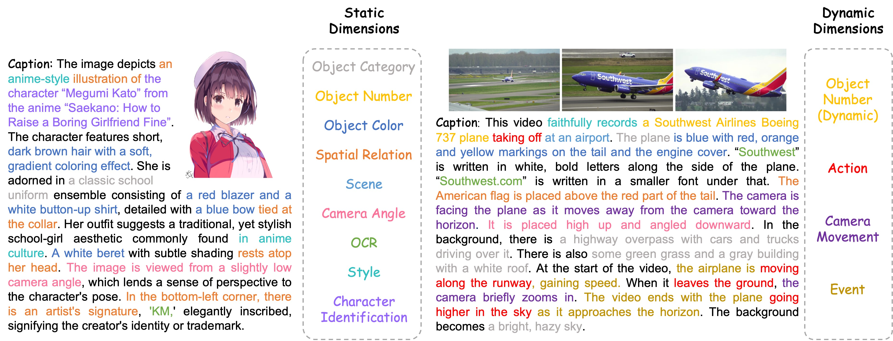
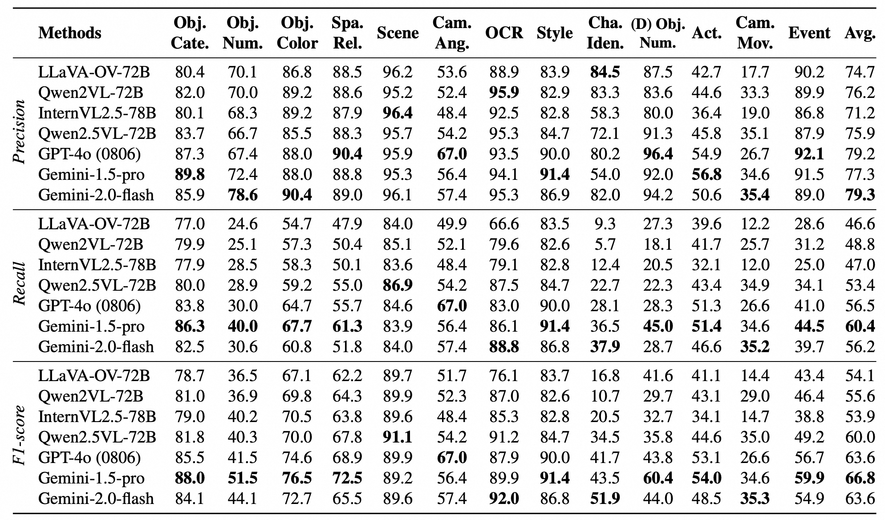
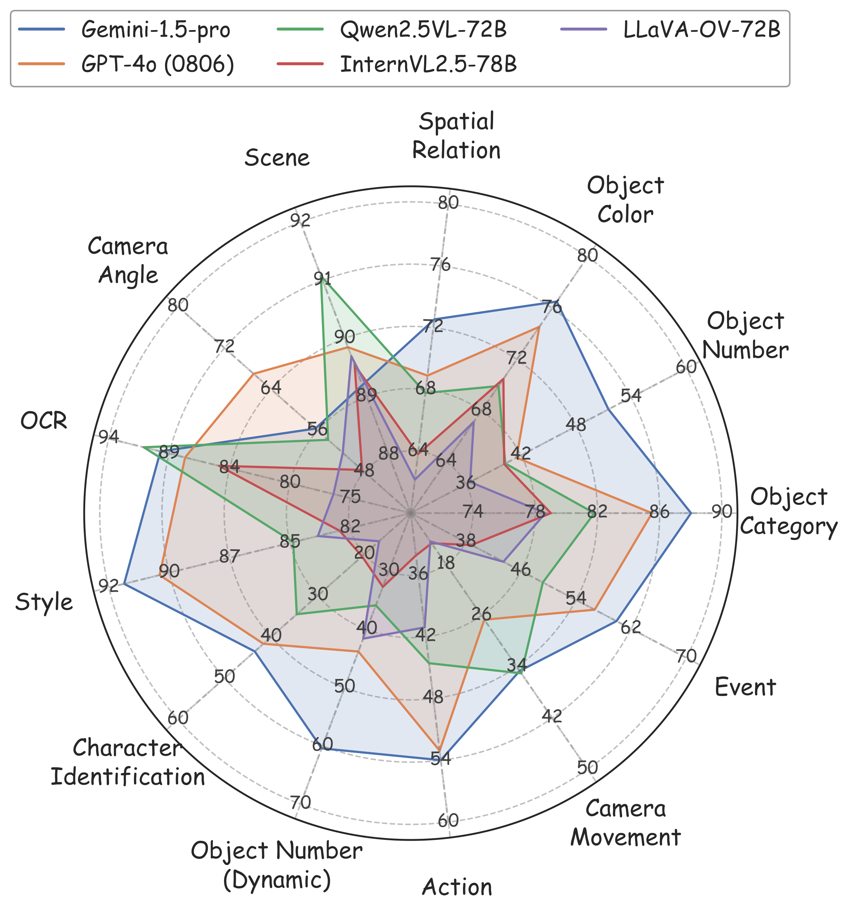
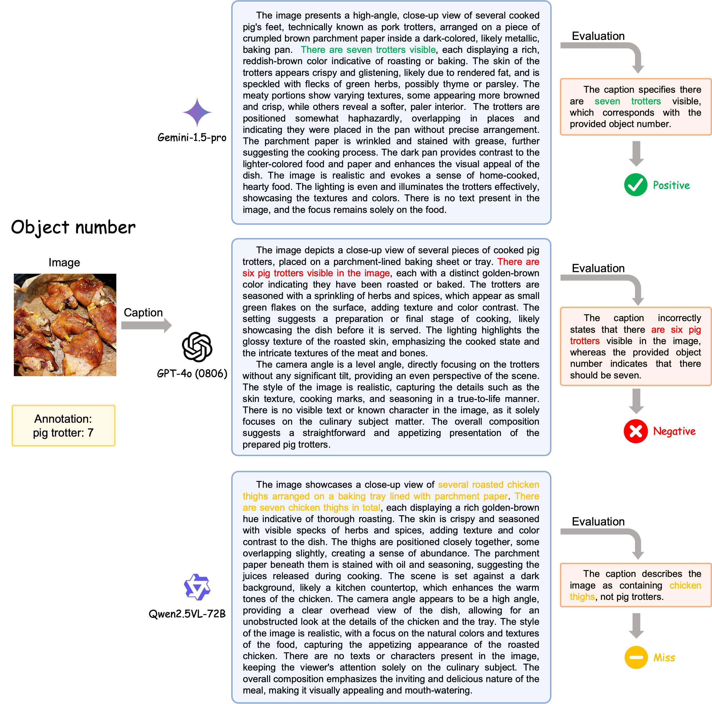
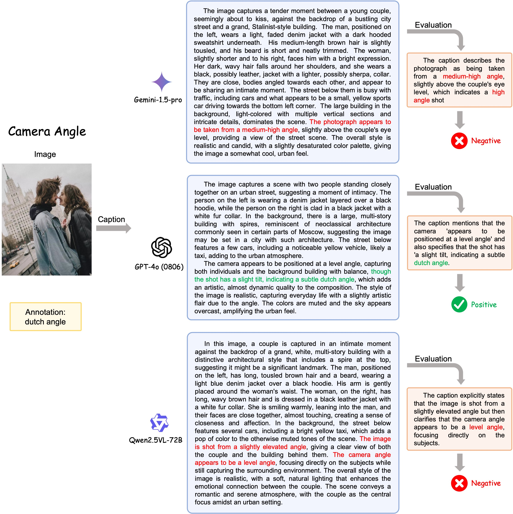

# CAPability
## What Is a Good Caption? A Comprehensive Visual Caption Benchmark for Evaluating Both Correctness and Thoroughness

 
 
  
 

<!-- <p align="center">
    
</p> -->

<font size=3><div align='center' > [[🍎 Project Page](https://capability-bench.github.io/)] [[📖 ArXiv Paper](https://arxiv.org/pdf/2502.14914)] [[🤗 HF Dataset](https://huggingface.co/datasets/lntzm/CAPability)] [[🏆 Leaderboard](https://capability-bench.github.io/#leaderboard)]  </div></font>


---

## 📋 Todo List
- Bump the evaluation model from GPT-4-Turbo to GPT-4.1-2025-04-14.
- Support [lmms-eval](https://github.com/EvolvingLMMs-Lab/lmms-eval) for more convenient evaluation.
- Release QA format annotations of CAPability to support the metric $K\bar{T}$.
- Release basic inference and evaluation code reported in the paper.

## 🔥 News
- **[2025.04.16]** Release the data on [🤗 Huggingface](https://huggingface.co/datasets/lntzm/CAPability).
- **[2025.04.15]** Updata the paper on [ArXiv](https://arxiv.org/abs/2502.14914).
- **[2025.02.19]** Release our paper on [ArXiv](https://arxiv.org/abs/2502.14914).


## 👀 CAPability Overview

<p align="center">
    
</p>

Visual captioning benchmarks have become outdated with the emergence of modern MLLMs, as the brief ground-truth sentences and traditional metrics fail to assess detailed captions effectively. While recent benchmarks attempt to address this by focusing on keyword extraction or object-centric evaluation, they remain limited to vague-view or object-view analyses and incomplete visual element coverage. We introduce CAPability, a comprehensive multi-view benchmark for evaluating visual captioning across 12 dimensions spanning six critical views. We curate nearly 11K human-annotated images and videos with visual element annotations to evaluate the generated captions. CAPability stably assesses both the correctness and thoroughness of captions using F1-score. By converting annotations to QA pairs, we further introduce a heuristic metric, *know but cannot tell* ($K\bar{T}$), indicating a significant performance gap between QA and caption capabilities. Our work provides the first holistic analysis of MLLMs' captioning abilities, as we identify their strengths and weaknesses across various dimensions, guiding future research to enhance specific aspects of capabilities.


## 📐 Dataset Examples

<p align="center">
    
</p>


## 🔍 Dataset

**License**:
```
CAPability is only used for academic research. Commercial use in any form is prohibited.
The copyright of all images and videos belongs to the media owners.
If there is any infringement in CAPability, please email liuzhihang@mail.ustc.edu.cn and we will remove it immediately.
Without prior approval, you cannot distribute, publish, copy, disseminate, or modify CAPability in whole or in part. 
You must strictly comply with the above restrictions.
```

Please send an email to **liuzhihang@mail.ustc.edu.cn**. 🌟


## 🔮 Evaluation Pipeline

📍 **Inference**:

There are 9 static dimensions (image) and 4 dynamic dimensions (video), totally 11.6 K images and videos.
To infer the visual captions, we recommend to use the same prompt for all image dimensions, and also the same prompt for all video dimensions. The prompts we evaluate all models are here:

- Image prompt:
    ```
    Please describe the image in detail. Your description should follow these rules:\n
    a) You should describe each object in the image in detail, including its name, number, color, and spatial relationship between objects.\n
    b) You should describe the scene of the image.\n
    c) You should describe the camera angle when shooting this image, such as level angle, high angle, low angle, or dutch angle.\n
    d) You should describe the style of the image, such as realistic, animated, special-effect, old-fashioned and so on.\n
    e) If there are any texts in the image, you should describe the text content.\n
    f) If you know the character in the image, you should tell his or her name.\n
    Directly output your detailed description in a elaborate paragraph, instead of itemizing them in list form. Your description:
    ```

- Video prompt:
    ```
    Please describe the video in detail. Your description should follow these rules:\n
    a) You should describe each events in the video in order, especially focusing on the behavior and action of characters, including people, animals.\n
    b) You should describe each object in the video in detail, including its name, number, color, and spatial relationship between objects.\n
    c) You should describe the scene of the video.\n
    d) You should describe the camera movement when shooting this video, especially the direction, such as pan left, track right, tilt up, boom down, zoom in, dolly out, and so on.\n
    e) You should describe the style of the video, such as realistic, animated, special-effect, old-fashioned and so on.\n
    f) If there are any texts in the video, you should describe the text content.\n
    g) If you know the character in the video, you should tell his or her name.\n
    Directly output your detailed description in a elaborate paragraph, instead of itemizing them in list form. Your description:
    ```

For the reported LLMs, you can run `bash inference/inference.sh` to get inference results in `./inference/output/`. You can also run your own model and save the caption on your path. We recommend to save the inference results of each dimension to `jsonl` files, and each row includes two fields: `file_id` and `caption`. See folder [output](./inference/output/) for more details, which is our inference results reported in the paper.


📍 **Evaluation**:

We use GPT-4-Turbo to compare the generated caption with our annotations for each dimension. You can refer to [prompt.py](./evaluation/prompt.py) to check our evaluation prompts.
[eval.py](./evaluation/eval.py) is our evaluation process, and [output](./evaluation/output/) lists all our evaluation results reported in the paper.

Usage:
```bash
SERVER_URL=YOUR_OPENAI_SERVER_URL API_KEY=YOUR_OPENAI_API_KEY python evaluation/eval.py \
    --caption_file_root inference/output/gemini-1.5-pro \
    --gt_file_root annotations \
    --tasks all \
    --num_process 40 \
    --eval_model gpt-4-turbo \
    --max_retry_times 5 \
    --max_allow_missing 5

```

📍 **Leaderboard**: 

We plan to support `lmms-eval` for more convenient inference and evaluation, and update the score of models which are supported by `lmms-eval` on our [leaderboard](https://capability-bench.github.io/#leaderboard).
If you want to add your model to our [leaderboard](https://capability-bench.github.io/#leaderboard), please merge your model to `lmms-eval`, or directly send model responses to **liuzhihang@mail.ustc.edu.cn**, as the format of [qwen2.5vl_72b](evaluation/output/qwen2.5vl_72b/).


## 📈 Experimental Results
- **Evaluation results of different MLLMs.**

<p align="center">
    
    
</p>


- **Evaluation examples.**

<p align="center">
    
</p>

<p align="center">
    
</p>


## :black_nib: Citation

If you find our work helpful for your research, please consider citing our work.   

```bibtex
@article{liu2025good,
  title={What Is a Good Caption? A Comprehensive Visual Caption Benchmark for Evaluating Both Correctness and Thoroughness},
  author={Liu, Zhihang and Xie, Chen-Wei and Wen, Bin and Yu, Feiwu and Chen, Jixuan and Zhang, Boqiang and Yang, Nianzu and Li, Pandeng and Li, Yinglu and Gao, Zuan and Zheng, Yun and Xie, Hongtao},
  journal={arXiv preprint arXiv:2502.14914},
  year={2025}
}
```

